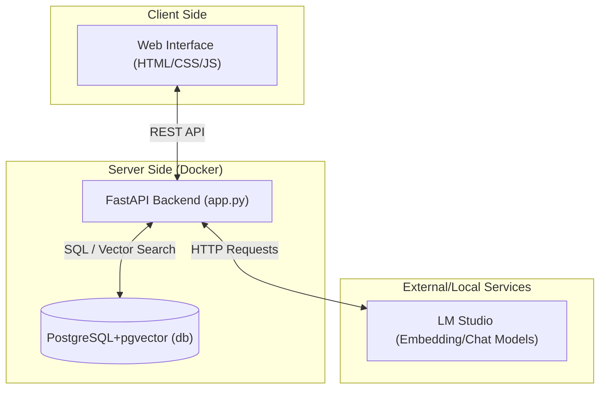
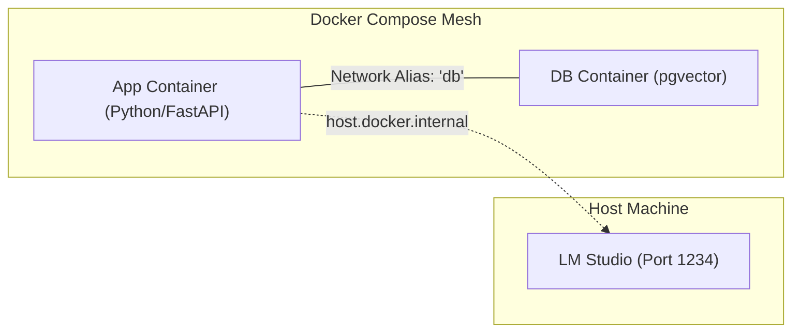

# System Architecture & Tech Stack

This document outlines the technical architecture and data flows for the Prompt Similarity Detector.

## 🛠️ Technology Stack

| Layer | Technology | Purpose |
| :--- | :--- | :--- |
| **Frontend** | Vanilla HTML, CSS, JavaScript | Interactive UI with Glassmorphism design and real-time state management. |
| **Backend** | Python (FastAPI) | High-performance asynchronous REST API handling logic and orchestration. |
| **Database** | PostgreSQL + `pgvector` | Relational storage for projects/environments and vector storage for prompt embeddings. |
| **AI Provider** | LM Studio (OpenAI-compatible API) | Local LLM inference for generating embeddings and performing compliance analysis. |
| **Testing** | Pytest, Mock, HTTPX | Automated unit and integration testing with service mocking. |
| **Deployment** | Docker, Docker Compose | Containerized orchestration for the App and Database. |

---

## 🏗️ System Architecture

The following diagram illustrates the high-level components and their interactions:

---

## 🔄 Data Flow: Prompt Analysis

This diagram tracks the lifecycle of a prompt during an "Analyze" request:

```mermaid
sequenceDiagram
    participant User as User (UI)
    participant API as FastAPI Backend
    participant LM as LM Studio
    participant DB as PostgreSQL (pgvector)

    User->>API: POST /api/check (prompt_text)
    
    rect rgb(40, 44, 52)
        Note over API, LM: Compliance Check
        API->>LM: Request Chat Completion (Prompt vs Requirements)
        LM-->>API: Compliance Summary
    end

    rect rgb(40, 44, 52)
        Note over API, LM: Vectorization
        API->>LM: Request Embedding
        LM-->>API: High-Dimensional Vector
    end

    rect rgb(40, 44, 52)
        Note over API, DB: Similarity Search
        API->>DB: Cosine Similarity Query (pgvector)
        DB-->>API: Match Results (if any)
    end

    alt No Significant Similarity
        API->>DB: Persist New Prompt
        API-->>User: Result (Success + Auto-Saved)
    else Similarity Found
        API-->>User: Result (Warning + Similar Prompts)
    end
```

---

## 📦 Deployment Orchestration

The system is designed for multi-container deployment using Docker Compose:

