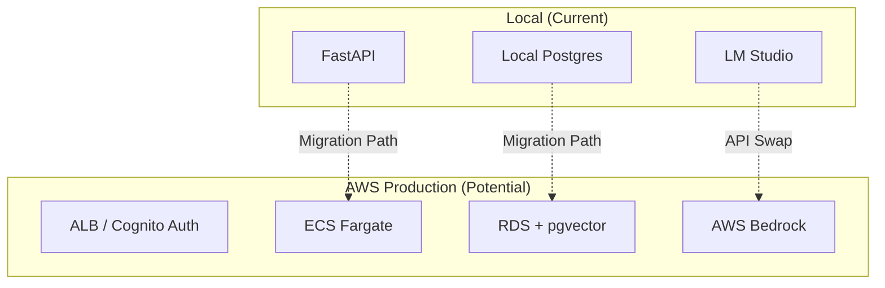

# Scaling Roadmap: AWS & Multi-Tenant Support

Moving from a local tool to a production-grade cloud application involves several structural changes. This document outlines the recommended strategy for AWS deployment and multi-user support.

## 1. Multi-User Architecture (Multi-Tenancy)

To support multiple users/teams, the system must transition from a "single-owner" model to a multi-tenant model.

### Database Schema Changes
Add a `users` table and tenant identifiers to existing tables:
*   **[NEW] `users` table**: Store `id`, `email`, `password_hash`, and `tenant_id`.
*   **[MOD] All Tables**: Add a `user_id` or `organization_id` column to `projects`, `environments`, and `prompts` to ensure strict data isolation.
*   **RLS**: Enable PostgreSQL **Row Level Security (RLS)** to automatically filter data based on the authenticated session.

### Authentication & Authorization
*   **Provider**: Use **AWS Cognito** for managed user pools (sign-up, login, MFA).
*   **API Security**: Implement **JWT (JSON Web Tokens)** validation in the FastAPI backend using `FastAPI Users` or a custom middleware.
*   **Permissions**: Add RBAC (Role-Based Access Control) to distinguish between `Admins` (can delete projects) and `Editors`.

---

## 2. AWS Infrastructure Stack

The recommended stack for AWS leverages managed services to reduce operational overhead:

| Component | AWS Service | Rationale |
| :--- | :--- | :--- |
| **Compute** | **AWS ECS (Fargate)** | Serverless container hosting for the FastAPI app. No server management required. |
| **Database** | **Amazon RDS (PostgreSQL)** | Fully managed DB. RDS now supports the **`pgvector`** extension natively. |
| **AI Inference** | **AWS Bedrock** | Access Titan, Claude, or Llama models via an API, replacing the local LM Studio server. |
| **Static Hosting** | **AWS Amplify** or **S3 + CloudFront** | Host the frontend assets globally with low latency. |
| **Load Balancer** | **Application Load Balancer (ALB)** | Handle SSL termination and distribute traffic to ECS tasks. |

---

## 3. Implementation Workflow

### Phase 1: Cloud-Ready Backend
1.  **Model Provider Abstraction**: Update `similarity_check.py` to support multiple providers (LM Studio, OpenAI, AWS Bedrock) via a unified interface.
2.  **Auth Middleware**: Add an authentication layer to FastAPI that requires a Bearer Token for all `/api/` calls.

### Phase 2: Infrastructure as Code (IaC)
1.  **AWS CDK or Terraform**: Define the entire stack (VPC, RDS, ECS) in code.
2.  **CI/CD**: Use **GitHub Actions** or **AWS CodePipeline** to automatically build the Docker image and deploy to ECS on every push.

### Phase 3: Monitoring & Logging
1.  **CloudWatch**: Integrate logging and set up alarms for API errors or high database latency.
2.  **X-Ray**: Use distributed tracing to monitor the speed of embedding generation and similarity searches.

---

## 4. Architectural Shift: Local vs. Cloud

